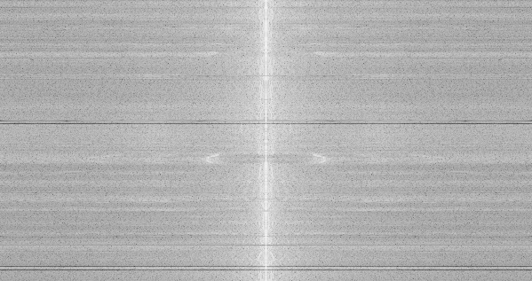

# Project-PCSC
Adam Mesbahi Amrani -- 387382

Sebbar Aziz -- 

This repo implements a software for sound and image processing. It allows the user to compute the dft, perform filtering and perform convolutions to denoise or exctract the contours. 

---

## Content table

- [Installation](#installation)
- [Fonctionnalities](#fonctionnalities)
- [Tests](#tests)

---

## Installation

This section explains how to correctly install and use this repository. We make use of **mpg123** and **ImageMagick**.  

### MacOS

Follow these steps:

```bash
git clone https://github.com/sebbaraziz112/Project-PCSC.git
cd Project-PCSC
chmod +x build.sh
chmod +x clean.sh
chmod +x soft_rebuild.sh
chmod +x hard_rebuild.sh
chmod +x install_mac.bash
./install_mac.bash
./build.sh
```

### Linux

Follow these steps:

```bash
git clone https://github.com/sebbaraziz112/Project-PCSC.git
cd Project-PCSC
chmod +x build.sh
chmod +x clean.sh
chmod +x soft_rebuild.sh
chmod +x hard_rebuild.sh
chmod +x install_linux.bash
./install_linux.bash
./build.sh
```

### Windows

For now, the project is not availabe on windows machines

---

## Fonctionnalities

Open the terminal and type

```bash
imsonpro
```
You will get the following result
```bash
Usage: imsonpro <command> [args]
The availabe commands are: 
      - dft-image [filename]
      - convolve-image [convolve type] [filename]
            convolve: -SobelX (Horizontal Contouring)
                      -SobelY (Vertical Contouring)
                      -Blurr (5-Neighbours Gaussian blurring)
                      -LapClass (Classic Laplacian)
                      -Lap4 (4-neighbor Laplacian)
                      -Lap8 (8-neighbor Laplacian)
                      -LapGauss (Gaussian Laplacian)
      - hist-image [filename]
      - bandfilter-image [filename] [prct bottom] [prct top]
      - dft-sound [fileame]
      - bandfilter-sound [filename] [prct bottom] [prct top]
      - hist-sound [filename]
```

The commands for the images and the sounds are different. 

### Image commands

This software supports .png and .bmp image files. 

#### dft-image 
The dft-image command uses the Bluestein algorithm (base on Radix-2 algorithm) to compute the DFT of an image. This DFT is then stored as an image too in the .bmp format. 

Example of usage: 
```bash
cd Projet-PCSC/ressources/ImageFolder
imsonpro dft-image bird.png
```

The dft file is saved as bird_dft.bmp

The result is the following: 


The execution can take some time depending on your machine

#### convolve-image
The convolve-image command uses different kind of kernels to perform convolutions on an image. In total, there are seven kernels available: 
- SobelX: it highlights contouring in the X axis of the image
- SobelY: it highlights contouring in the Y axis of the image
- Blurr: it uses a 5x5 gaussian kernel to blurr the image
- LapClass: uses a Classical Laplacian kernel
- Lap4: 4-neighbour laplacian
- Lap8: 8-neighbour laplacian
- LapGauss: Gaussian laplacian

Example of usage: 
```bash
cd Projet-PCSC/ressources/ImageFolder
imsonpro convolve-image Blurr BETTERMAN_2.bmp
```

The new file is saved as: BETTERMAN_2_Blurr.bmp

The result is the following: 


Another example of usage is the contouring: 

```bash
cd Projet-PCSC/ressources/ImageFolder
imsonpro convolve-image SobelX BETTERMAN_2.bmp
```


#### hist-image
The hist-image command generated three histograms (one for Red, one for Blue and one for Green) of intensity of pixels. 

Example of usage: 
```bash
cd Projet-PCSC/ressources/ImageFolder
imsonpro hist-image Mauritius_beach.png
```

The files generated are: 
- Mauritius_beach_histogram_B.png
- Mauritius_beach_histogram_G.png
- Mauritius_beach_histogram_R.png

#### bandfilter-image
The bandfilter-image command uses the Bluestein algorithm (base on Radix-2 algorithm) to compute the DFT of an image, then filters the DFT and then computes the inverse DFT to get a new image. This can be useful for noise reduction. This command uses two arguments: 
- prct bottom: 0-100
- prct top: 0-100
For both axis of the image, every complex value of the dft is set to 0 if the pixel is not located in [Width * prct bottom, Width * prct rop] x [Height * prct bottom, Height * prct top]

Example of usage: 
```bash
cd Projet-PCSC/ressources/ImageFolder
imsonpro bandfilter-image BETTERMAN_2.bmp 20 80
```

Several files are saved: 
- BETTERMAN_2_dft.bmp
- BETTERMAN_2_bandfiltered_dft.bmp
- BETTERMAN_2_bandfiltered.bmp

The result is the following: 

This is the original image: 


This is the new one:


This is the cropped DFT:


If you observe well the two first images, you will see that the details (noise) on the back of the person sitting on the rock have disappeared. 


### Sound commands

This software supports .mp3 and .wav files

#### dft-sound
dft-sound uses the BlueStein method to compute the DFT. However, the bluestein method being sensitive to numerical instabilities for very long sounds, we decide to split the sound into several sub-sounds and compute the DFT for each. The result is thus a matrix where each line is the DFT of a subsound. 

Example of usage: 
```bash
cd Projet-PCSC/ressources/TrackFolder
imsonpro dft-sound noisy1.wav
```

The result is the following: 



#### bandfilter-sound 
bandfilter-sound computes the dft od a sound as explained before, then applies a cropping on the dft and then computes the inverse dft. 

Example of usage: 
```bash
cd Projet-PCSC/ressources/TrackFolder
imsonpro bandfilter-sound ./noisy1.wav 20 80
```

The generated files are the following:
- noisy1_bandfiltered.wav
- noisy1_dft_banded_image.bmp
- noisy1_dft_image.bmp

#### hist-sound

The hist-sound command generated a histogram of intensity for each channel.

Example of usage: 
```bash
cd Projet-PCSC/ressources/TrackFolder
imsonpro hist-sound noisy1.wav
```

The files generated are: 
- noisy1_histogram_chann_i.png

for each channel i.

An example of result is the following: 


## Tests

To run the tests, run the following commands: 

```bash
cd build
./unit_tests
```

There are 25 tests that tak in total less than 2 minutes to run: 
Voici la liste des **noms des 25 tests** :

1. `DATA_READ_WRITE.FULL_PIPELINE_SOUND`: Reads sound data and writes it back to file and verifies the files are the same
2. `DATA_READ_WRITE.FULL_PIPELINE_IMAGE`: Reads image data and writes it back to file and verifies the files are the same
3. `FFT1D_TEST.FORWARD_PASS_1D`: compares naive DFT with Radix-2 algo on 1D example
4. `FFT1D_TEST.BACKWARD_PASS_1D`: compares naive inverse DFT with inverse Radix-2 algo on 1D example
5. `FFT1D_TEST.IDENTITY_1D`: compares x and IFFT(FFT(x)) on a 1D example
6. `BLUESTEIN1D_TEST.FORWARD_PASS_1D`: compares naive DFT with 1D bluestein method
7. `BLUESTEIN1D_TEST.BACKWARD_PASS_1D`: compares naive inverse DFT with 1D inverse bluestein method
8. `BLUESTEIN1D_TEST.IDENTITY_1D`: compares x with IBS1D(BS1D(x))
9. `BLUESTEIN_TEST.FORWARD_PASS_1D`: compares naive DFT with bluestein method on 1D example
10. `BLUESTEIN_TEST.FORWARD_PASS_2D`: compares naive DFT with bluestein method on 2D example
11. `BLUESTEIN_TEST.BACKWARD_PASS_1D`: compares naive inverse DFT with inverse bluestein method on 1D example
12. `BLUESTEIN_TEST.BACKWARD_PASS_2D`: compares naive inverse DFT with inverse bluestein method on 2D example
13. `BLUESTEIN_TEST.IDENTITY_1D`: compares 1D x with IBS(BS(x))
14. `BLUESTEIN_TEST.IDENTITY_2D`: compares 2D x with IBS(BS(x))
15. `BLUESTEIN_TEST.IDENTITY_1D_BIG`: compares big 1D x with IBS(BS(x))
16. `BLUESTEIN_TEST.IDENTITY_2D_BIG`: compares big 2D x with IBS(BS(x))
17. `LINE_ONLY_BLUESTEIN_TEST.IDENTITY_1D`
18. `LINE_ONLY_BLUESTEIN_TEST.IDENTITY_1D_BIG`
19. `LINE_ONLY_BLUESTEIN_TEST.IDENTITY_1D_SOUND`
20. `SHIFT_MATRIX.IDENTITY_EVEN_TEST_2D`: shifts to center and then back to original and verifies that it is equal to original matrix for even sized matrix
21. `SHIFT_MATRIX.IDENTITY_ODD_TEST_2D`: shifts to center and then back to original and verifies that it is equal to original matrix for odd sized matrix
22. `SHIFT_MATRIX.IDENTITY_EVEN_TEST_1D`: shifts to center and then back to original and verifies that it is equal to original matrix for even sized vector
23. `SHIFT_MATRIX.IDENTITY_ODD_TEST_1D`: shifts to center and then back to original and verifies that it is equal to original matrix for odd sized matrix
24. `MATRIX_VECTOR_TESTS.FACTORS`: verifies that getFactor(N) method gives a and b such that axb = N
25. `MATRIX_VECTOR_TESTS.IDENTITY`: verifies that matrixToVector(vectorToMatrix(vector)) = vector

