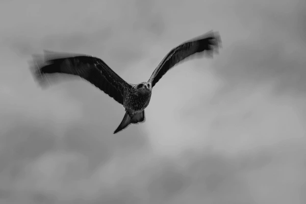
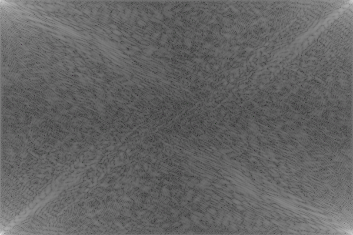
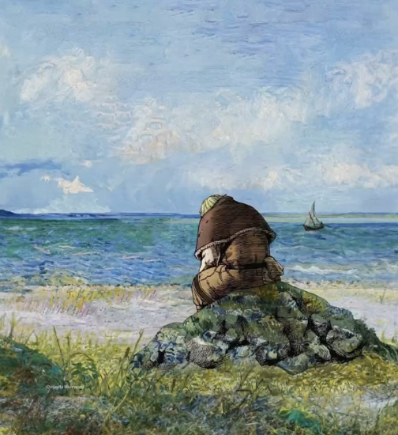
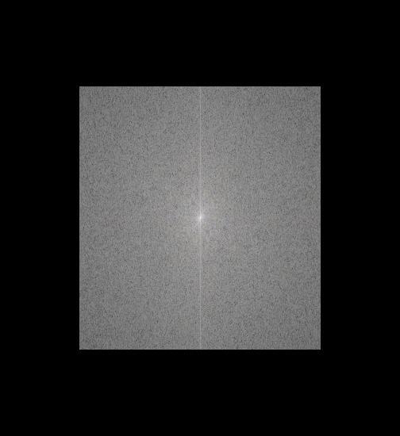

# Project-PCSC
Adam Mesbahi Amrani -- 387382

Sebbar Aziz -- 

This repo implements a software for sound and image processing. It allows the user to compute the dft, perform filtering and perform convolutions to denoise or exctract the contours. 

---

## Content table

- [Installation](#installation)
- [Fonctionnalities](#fonctionnalities)
- [Examples](#examples)
- [Contact](#contact)

---

## Installation

This section explains how to correctly install and use this repository. We make use of **mpg123** and **ImageMagick**.  

### MacOS

Follow these steps:

```bash
git clone https://github.com/sebbaraziz112/Project-PCSC.git
cd Project-PCSC
chmod +x build.sh
chmod +x clean.sh
chmod +x soft_rebuild.sh
chmod +x hard_rebuild.sh
chmod +x install_mac.bash
./install_mac.bash
./build.sh
```

### Linux

Follow these steps:

```bash
git clone https://github.com/sebbaraziz112/Project-PCSC.git
cd Project-PCSC
chmod +x build.sh
chmod +x clean.sh
chmod +x soft_rebuild.sh
chmod +x hard_rebuild.sh
chmod +x install_linux.bash
./install_linux.bash
./build.sh
```

### Windows

For now, the project is not availabe on windows machines

---

## Fonctionnalities

Open the terminal and type

```bash
imsonpro
```
You will get the following result
```bash
Usage: imsonpro <command> [args]
The availabe commands are: 
      - dft-image [filename]
      - convolve-image [convolve type] [filename]
            convolve: -SobelX (Horizontal Contouring)
                      -SobelY (Vertical Contouring)
                      -Blurr (5-Neighbours Gaussian blurring)
                      -LapClass (Classic Laplacian)
                      -Lap4 (4-neighbor Laplacian)
                      -Lap8 (8-neighbor Laplacian)
                      -LapGauss (Gaussian Laplacian)
      - hist-image [filename]
      - bandfilter-image [filename] [prct bottom] [prct top]
      - dft-sound [fileame]
      - bandfilter-sound [filename] [prct bottom] [prct top]
      - hist-sound [filename]
```

The commands for the images and the sounds are different. 

### Image commands

This software supports .png and .bmp image files. 

#### dft-image 
The dft-image command uses the Bluestein algorithm (base on Radix-2 algorithm) to compute the DFT of an image. This DFT is then stored as an image too in the .bmp format. 

Example of usage: 
```bash
cd Projet-PCSC/ressources/ImageFolder
imsonpro dft-image bird.png
```

The dft file is saved as bird_dft.bmp

The result is the following: 





The execution can take some time depending on your machine

#### convolve-image
The convolve-image command uses different kind of kernels to perform convolutions on an image. In total, there are seven kernels available: 
- SobelX: it highlights contouring in the X axis of the image
- SobelY: it highlights contouring in the Y axis of the image
- Blurr: it uses a 5x5 gaussian kernel to blurr the image
- LapClass: uses a Classical Laplacian kernel
- Lap4: 4-neighbour laplacian
- Lap8: 8-neighbour laplacian
- LapGauss: Gaussian laplacian

Example of usage: 
```bash
cd Projet-PCSC/ressources/ImageFolder
imsonpro convolve-image Blurr BETTERMAN_2.bmp
```

The new file is saved as: BETTERMAN_2_Blurr.bmp

The result is the following: 




Another example of usage is the contouring: 


#### hist-image
The hist-image command generated three histograms (one for Red, one for Blue and one for Green) of intensity of pixels. 

Example of usage: 
```bash
cd Projet-PCSC/ressources/ImageFolder
imsonpro hist-image Mauritius_beach.png
```

The files generated are: 
- Mauritius_beach_histogram_B.png
- Mauritius_beach_histogram_G.png
- Mauritius_beach_histogram_R.png

#### bandfilter-image
The dft-image command uses the Bluestein algorithm (base on Radix-2 algorithm) to compute the DFT of an image, then filters the DFT and then computes the inverse DFT to get a new image. This can be useful for noise reduction. This command uses two arguments: 
- prct bottom: 0-100
- prct top: 0-100
For both axis of the image, every complex value of the dft is set to 0 if the pixel is not located in [Width * prct bottom, Width * prct rop] x [Height * prct bottom, Height * prct top]

Example of usage: 
```bash
cd Projet-PCSC/ressources/ImageFolder
imsonpro bandfilter-image BETTERMAN_2.bmp 20 80
```

Several files are saved: 
- BETTERMAN_2_dft.bmp
- BETTERMAN_2_bandfiltered_dft.bmp
- BETTERMAN_2_bandfiltered.bmp

The result is the following: 




If you observe well the two first images, you will see that the details (noise) on the back of the person sitting on the rock have disappeared. 